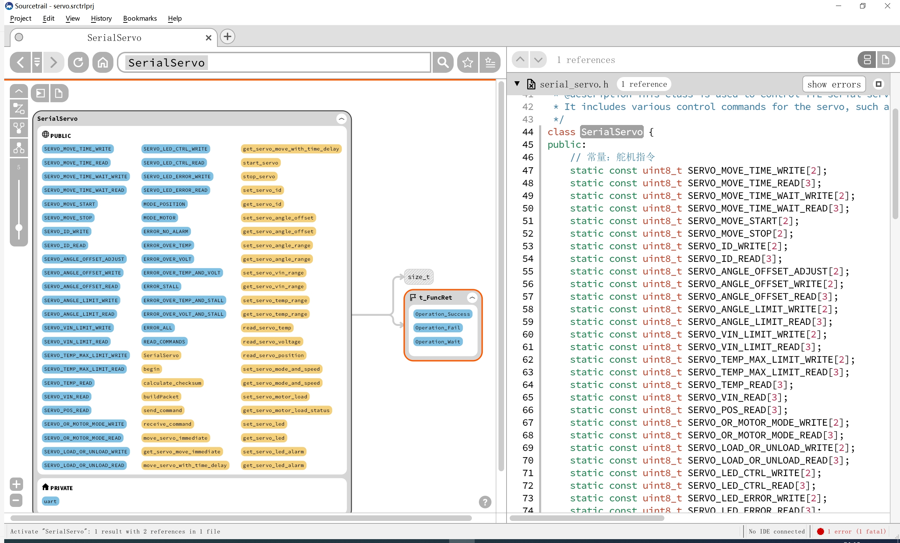
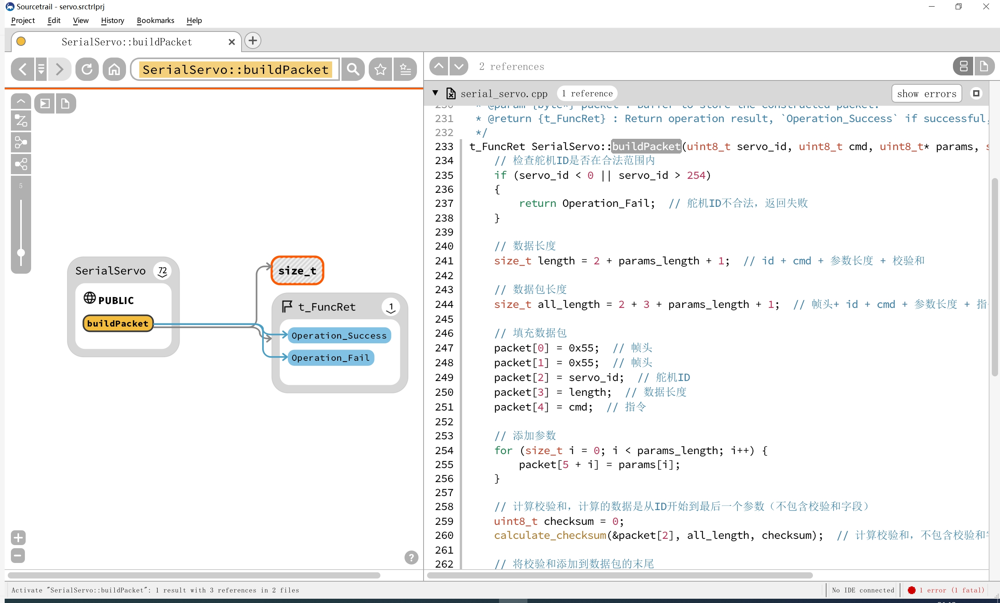
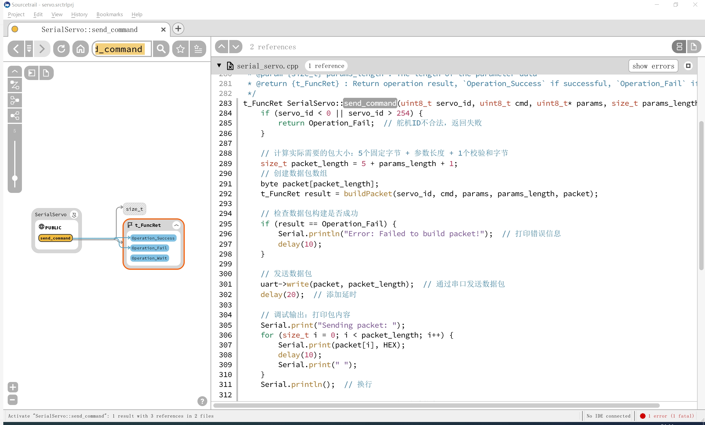
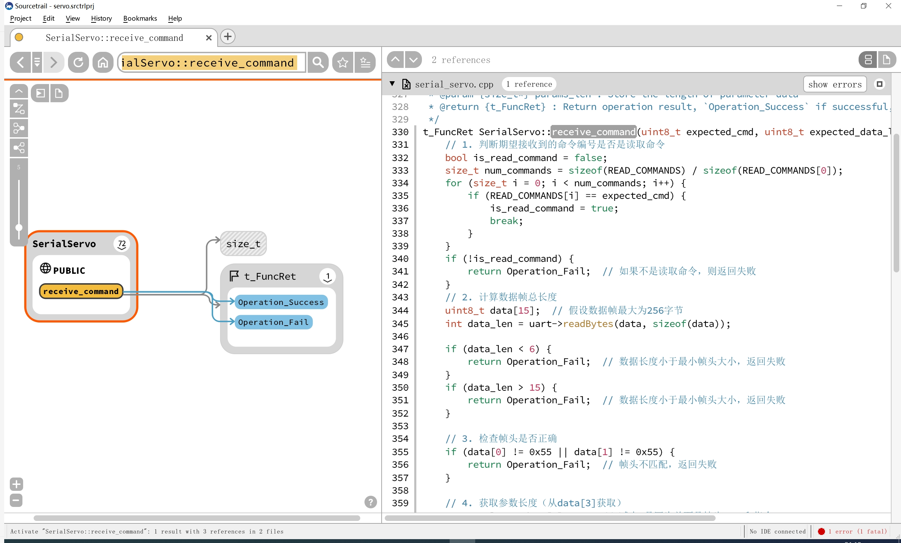

# 目录/MENU

- [中文部分](#串口舵机扩展板（FreakStudio）示例程序-MicroPython版本)
- [English Section](#SerialServo-Expansion-Board-(FreakStudio)-Example-Program-MicroPython-Version)

# 串口舵机扩展板（FreakStudio）示例程序-Arduino版本

该示例程序展示了如何使用Arduino控制串口舵机扩展板（FreakStudio）。通过串口通信，用户可以控制多个舵机的角度、速度等参数，实现高效、灵活的舵机控制。
程序中使用了串口通讯与舵机进行数据交互，提供了完整的控制命令和反馈解析功能。

该软件必须在提供的串口舵机扩展板（由FreakStudio开发设计）上运行，才能确保其正常工作。请参阅硬件开源链接和商品链接获取详细信息。

- **商品链接**：[串口舵机扩展板购买链接]
- **硬件开源链接**：[硬件开源资料链接]

## 主要特性

- 使用HardwareSerial串口与舵机通信，支持多舵机控制。
- 支持舵机的角度、速度、工作模式等多种设置。
- 支持舵机温度、电压、角度等实时读取。
- 校验和机制确保数据传输的完整性，幻尔科技串口舵机28条指令全部实现，并且封装为类。
- 完整的异常捕获机制，对入口参数进行详细检查。
- 注释完善，所有方法和类均提供了类型注解。

## 文件说明

### 主要类和方法介绍

#### `SerialServo` 类

该类封装了舵机控制相关的所有功能，包括生成和发送控制指令、接收舵机反馈、读取舵机状态等。


- `SerialServo(HardwareSerial& uart)`：初始化串口舵机控制类。
- `t_FuncRet begin(unsigned long baudRate)`：初始化串口波特率。
- `t_FuncRet calculate_checksum(uint8_t* data, uint8_t length, uint8_t& checksum)`：计算校验和，确保数据的完整性和正确性。
- `t_FuncRet buildPacket(uint8_t servo_id, uint8_t cmd, uint8_t* params, size_t params_length,byte* packet)`：构建舵机控制指令包。
- `t_FuncRet send_command(uint8_t servo_id, uint8_t cmd, uint8_t* params, size_t params_length)`：发送控制指令到指定舵机。
- `t_FuncRet receive_command(uint8_t expected_cmd, uint8_t expected_params_len, uint8_t* params, size_t* params_len)`：接收并解析舵机返回的指令数据包。
- `t_FuncRet move_servo_immediate(uint8_t servo_id, float angle, uint16_t time_ms)`：立即控制舵机转动到指定角度。
- `t_FuncRet get_servo_move_immediate(uint8_t servo_id, float* angle_value, uint16_t* time_value)`：获取舵机的预设角度和时间。
- `t_FuncRet move_servo_with_time_delay(uint8_t servo_id, float angle, uint16_t time_ms)`：控制舵机延迟转动到指定角度。
- `t_FuncRet get_servo_move_with_time_delay(uint8_t servo_id, float &angle, uint16_t &time_ms)`：获取舵机的延迟转动角度和时间。
- `t_FuncRet start_servo(uint8_t servo_id)`：启动舵机的转动。
- `t_FuncRet stop_servo(uint8_t servo_id)`：立即停止舵机转动并停在当前角度位置。
- `t_FuncRet set_servo_id(uint8_t servo_id, uint8_t new_id)`：设置舵机的新 ID 值。
- `t_FuncRet get_servo_id(uint8_t servo_id, uint8_t* servo_id_value)`：获取舵机的 ID。
- `t_FuncRet set_servo_angle_offset(uint8_t servo_id, float angle, bool save_to_memory)`：根据角度值调整舵机的偏差。
- `t_FuncRet get_servo_angle_offset(uint8_t servo_id, float& angle_offset)`：获取舵机的偏差角度。
- `t_FuncRet set_servo_angle_range(uint8_t servo_id, float min_angle, float max_angle)`：设置舵机的最小和最大角度限制。
- `t_FuncRet get_servo_angle_range(uint8_t servo_id, float* min_angle, float* max_angle)`：获取舵机的角度限位。
- `t_FuncRet set_servo_vin_range(uint8_t servo_id, float min_vin, float max_vin)`：设置舵机的最小和最大输入电压限制。
- `t_FuncRet get_servo_vin_range(uint8_t servo_id, float& min_vin, float& max_vin)`：获取舵机的电压限制值。
- `t_FuncRet set_servo_temp_range(uint8_t servo_id, int max_temp)`：设置舵机的最高温度限制。
- `t_FuncRet get_servo_temp_range(uint8_t servo_id, int& max_temp_limit)`：获取舵机的内部最高温度限制值。
- `t_FuncRet read_servo_temp(uint8_t servo_id, int& temperature)`：获取舵机的实时温度。
- `t_FuncRet read_servo_voltage(uint8_t servo_id, float& voltage)`：获取舵机的实时输入电压。
- `t_FuncRet read_servo_position(uint8_t servo_id, float& position_angle)`：获取舵机的实时角度位置。
- `t_FuncRet set_servo_mode_and_speed(uint8_t servo_id, int mode, int speed)`：设置舵机的工作模式和电机转速。
- `t_FuncRet get_servo_mode_and_speed(uint8_t servo_id, int& mode, int& speed)`：获取舵机的工作模式和转动速度。
- `t_FuncRet set_servo_motor_load(uint8_t servo_id, bool unload)`：设置舵机的电机是否卸载掉电。
- `t_FuncRet get_servo_motor_load_status(uint8_t servo_id, bool &motor_loaded)`：获取舵机电机是否装载或卸载。
- `t_FuncRet set_servo_led(uint8_t servo_id, bool led_on)`：设置舵机的 LED 灯的亮灭状态。
- `t_FuncRet get_servo_led(uint8_t servo_id, bool &led_on)`：获取舵机 LED 的亮灭状态。
- `t_FuncRet set_servo_led_alarm(uint8_t servo_id, uint8_t alarm_code)`：设置舵机 LED 闪烁报警对应的故障值。
- `t_FuncRet get_servo_led_alarm(uint8_t servo_id, uint8_t &alarm_value)`：获取舵机 LED 故障报警状态。

### 核心方法介绍

该类的核心是通过 HardwareSerial（硬件串口）与舵机通信。类中的常量定义包括了多种控制命令和舵机相关的设置。这些常量包括了指令的编号、参数长度和返回数据长度。例如：

* `SERVO_MOVE_TIME_WRITE` 和 `SERVO_MOVE_TIME_READ` 是与舵机位置控制相关的指令及其参数格式。
* `SERVO_ID_WRITE` 和 `SERVO_ID_READ` 是与舵机ID相关的读写指令。

这些常量帮助类在进行通信时，能确保发送正确的指令和正确解析返回的数据。

`READ_COMMANDS` 数组定义了所有读取命令的编号，这些命令对应舵机的数据读取请求，例如，读取舵机的实时电压、角度、温度等信息。
这个数组便于在 `receive_command()` 方法中判断接收到的数据是否为期望的读取命令。

串口舵机类的核心方法为：

* **构建数据包方法 `build_packet`**：该方法用于构建舵机控制的指令包，指令包由以下部分组成：
  * **帧头**：固定为 0x55, 0x55
  * **舵机ID**：唯一标识每个舵机 
  * **数据长度**：包括指令和参数
  * **指令编号**：具体的控制指令
  * **参数**：控制指令的参数
  * **校验和**：用于校验数据包的完整性



* **发送指令方法 `send_command`**：该方法构建指令包并通过 `uart` （`HardwareSerial* uart`）发送给舵机，它调用了` build_packet() `来构造数据包，然后通过` uart->write() `发送数据。


  
* **接收指令方法 `receive_command`**：`receive_command()`方法用于接收来自舵机的反馈数据，此方法的工作过程如下：
  1. **命令验证**：确认接收到的是读取命令，而不是其他类型的命令。
  2. **数据检查**：检查数据的帧头是否正确，命令编号是否匹配，数据长度是否符合预期。
  3. **校验和验证**：验证接收到的数据包的校验和是否正确，确保数据未被篡改。
  4. **数据解析**：根据返回的数据长度，解析并返回舵机的状态或数据（例如电压、角度等）。
  5. 如果数据包无效（如校验和错误、数据长度不符等），该方法将返回空列表。



SerialServo 类的设计通过封装舵机控制指令和数据包的构建逻辑，简化了舵机通信过程，核心思路是通过统一的数据包格式和校验机制确保指令的正确传输，结合 HardwareSerial 通信接口实现与舵机的高效交互。类内指令常量和参数处理使得操作更加清晰易懂，同时通过校验和和数据长度的验证确保数据的完整性和可靠性。

## 如何使用

### 安装依赖

在运行示例程序之前，确保你的Arduino环境配置无误。

1. 下载库文件保存为 `serial_servo.zip`。
2. 选择 **工具** > **管理库**。
3. 在库管理器窗口中，点击右上角的 **添加 .ZIP 库** 按钮。
4. 选择你刚才下载的 `SerialServo.zip` 文件，然后点击 **打开**。

库将会被自动导入到 Arduino IDE，接着就可以在代码中通过 `#include <SerialServo.h>` 来使用你的库了。

### 使用示例

```cpp
#include <Arduino.h>
#include "serial_servo.h"

// 创建 SerialServo 对象，传入串口对象
SerialServo servo(Serial2);  // 使用 Serial2 进行舵机控制

void setup() {
    // 初始化串口
    Serial.begin(115200);  // 设置主串口波特率（用于串口调试）
    Serial2.begin(115200, SERIAL_8N1, 16, 17); // 设置 Serial2 波特率，并指定数据位、起始引脚和停止引脚
    // SERIAL_8N1 表示 8 数据位、无校验、1 停止位
}

void loop() {
    uint8_t servo_id = 1;  // 设置舵机ID为1

    // 控制舵机立即转动到 90 度，持续时间 1000 毫秒（1 秒）
    servo.move_servo_immediate(servo_id, 90, 1000);  
    delay(1000);  // 延迟 1 秒

    // 控制舵机立即转动到 180 度，持续时间 1000 毫秒（1 秒）
    servo.move_servo_immediate(servo_id, 180, 1000);  
    delay(1000);  // 延迟 1 秒
}
```

## 注意事项

* **硬件连接**：确保舵机的电源和控制线正确连接
* **串口通信参数设置**：串口通信的波特率必须与舵机的波特率匹配，为115200，数据位为8，无校验位，停止位为1。
* **响应等待**：每次发送指令后，最好等待舵机响应，避免指令丢失。

## 结语

通过本示例程序，用户可以快速上手并实现对多个舵机的灵活控制。
此程序支持多种舵机控制模式，提供了强大的舵机状态读取功能，适合需要多舵机控制的项目需求。

## 联系开发者

- 如有任何问题或需要帮助，请通过 [10696531183@qq.com](mailto:10696531183@qq.com) 联系开发者。


## 许可协议

本项目采用 **[知识共享署名-非商业性使用 4.0 国际版 (CC BY-NC 4.0)](https://creativecommons.org/licenses/by-nc/4.0/)** 许可协议。

## 版本记录
* v1.0.0到v1.0.1版本：初始化该库，对说明文件进行小修改。

# SerialServo-Expansion-Board-(FreakStudio)-Example-Program-Arduino-Version

This example program demonstrates how to control the Serial Servo Expansion Board (FreakStudio) using Arduino. Through serial communication, users can control multiple servos' angles, speeds, and other parameters, enabling efficient and flexible servo control. The program uses serial communication to exchange data with the servos, providing complete control commands and feedback parsing functionality.

The software must run on the provided serial servo expansion board (designed by FreakStudio) to ensure proper operation. Please refer to the hardware open-source link and product link for detailed information.

- **Product Link**: [Bus Motor Driver Expansion Board Purchase Link]
  - **Hardware Open-Source Link**: [Hardware Open-Source Documentation Link]

## Main Features

- Use HardwareSerial serial communication to control multiple servos.
- Supports various settings for servo angles, speeds, and operating modes.
- Real-time reading of servo temperature, voltage, angle, etc.
- Checksum mechanism ensures data transmission integrity, implements all 28 control commands of the Phantom Technology serial servo, and encapsulates them into a class.
- Complete exception handling mechanism with detailed checks for input parameters.
- Well-commented code, with all methods and classes annotated with type hints.

## File Description

### Main Classes and Methods Introduction

#### `SerialServo` Class

This class encapsulates all servo control functions, including generating and sending control commands, receiving feedback from the servo, and reading servo status.


- `SerialServo(HardwareSerial& uart)`：Initializes the serial servo control class.
- `t_FuncRet begin(unsigned long baudRate)`：Initialize the serial port baud rate.
- `t_FuncRet calculate_checksum(uint8_t* data, uint8_t length, uint8_t& checksum)`：Calculates the checksum to ensure data integrity and correctness.
- `t_FuncRet buildPacket(uint8_t servo_id, uint8_t cmd, uint8_t* params, size_t params_length,byte* packet)`：Constructs the servo control command packet.
- `t_FuncRet send_command(uint8_t servo_id, uint8_t cmd, uint8_t* params, size_t params_length)`： Sends a control command to the specified servo.
- `t_FuncRet receive_command(uint8_t expected_cmd, uint8_t expected_params_len, uint8_t* params, size_t* params_len)`：Receives and parses the servo's response command packet.
- `t_FuncRet move_servo_immediate(uint8_t servo_id, float angle, uint16_t time_ms)`： Immediately moves the servo to the specified angle.
- `t_FuncRet get_servo_move_immediate(uint8_t servo_id, float* angle_value, uint16_t* time_value)`：Retrieves the preset angle and time of the servo.
- `t_FuncRet move_servo_with_time_delay(uint8_t servo_id, float angle, uint16_t time_ms)`：Moves the servo to the specified angle after a delay.
- `t_FuncRet get_servo_move_with_time_delay(uint8_t servo_id, float &angle, uint16_t &time_ms)`：Retrieves the delayed movement angle and time of the servo.
- `t_FuncRet start_servo(uint8_t servo_id)`：Starts the servo's movement.
- `t_FuncRet stop_servo(uint8_t servo_id)`：Immediately stops the servo's movement and keeps it at the current angle.
- `t_FuncRet set_servo_id(uint8_t servo_id, uint8_t new_id)`：Sets the new ID value for the servo.
- `t_FuncRet get_servo_id(uint8_t servo_id, uint8_t* servo_id_value)`：Retrieves the servo's ID.
- `t_FuncRet set_servo_angle_offset(uint8_t servo_id, float angle, bool save_to_memory)`：Adjusts the servo's offset based on the angle value.
- `t_FuncRet get_servo_angle_offset(uint8_t servo_id, float& angle_offset)`：Retrieves the servo's angle offset.
- `t_FuncRet set_servo_angle_range(uint8_t servo_id, float min_angle, float max_angle)`：Sets the servo's minimum and maximum angle limits.
- `t_FuncRet get_servo_angle_range(uint8_t servo_id, float* min_angle, float* max_angle)`：Retrieves the servo's angle limits.
- `t_FuncRet set_servo_vin_range(uint8_t servo_id, float min_vin, float max_vin)`：Sets the servo's minimum and maximum input voltage limits.
- `t_FuncRet get_servo_vin_range(uint8_t servo_id, float& min_vin, float& max_vin)`：Retrieves the servo's voltage limits.
- `t_FuncRet set_servo_temp_range(uint8_t servo_id, int max_temp)`：Sets the servo's maximum temperature limit.
- `t_FuncRet get_servo_temp_range(uint8_t servo_id, int& max_temp_limit)`：Retrieves the servo's internal maximum temperature limit.
- `t_FuncRet read_servo_temp(uint8_t servo_id, int& temperature)`：Reads the servo's real-time temperature.
- `t_FuncRet read_servo_voltage(uint8_t servo_id, float& voltage)`：Reads the servo's real-time input voltage.
- `t_FuncRet read_servo_position(uint8_t servo_id, float& position_angle)`：Reads the servo's real-time angle position.
- `t_FuncRet set_servo_mode_and_speed(uint8_t servo_id, int mode, int speed)`：Sets the servo's operation mode and motor speed.
- `t_FuncRet get_servo_mode_and_speed(uint8_t servo_id, int& mode, int& speed)`：Retrieves the servo's operation mode and speed.
- `t_FuncRet set_servo_motor_load(uint8_t servo_id, bool unload)`：Sets whether to unload the servo motor.
- `t_FuncRet get_servo_motor_load_status(uint8_t servo_id, bool &motor_loaded)`：Retrieves the servo motor load status.
- `t_FuncRet set_servo_led(uint8_t servo_id, bool led_on)`：Sets the servo's LED light state (on/off).
- `t_FuncRet get_servo_led(uint8_t servo_id, bool &led_on)`：Retrieves the servo's LED light state.
- `t_FuncRet set_servo_led_alarm(uint8_t servo_id, uint8_t alarm_code)`：Sets the servo's LED flashing alarm for specific fault codes.
- `t_FuncRet get_servo_led_alarm(uint8_t servo_id, uint8_t &alarm_value)`：Retrieves the servo's LED fault alarm status.

### Core Method Introduction

The core of this class is communication with the servo via HardwareSerial (hardware serial port). The constants in the class define various control commands and servo-related settings. These constants include instruction IDs, parameter lengths, and return data lengths. For example:

* `SERVO_MOVE_TIME_WRITE` and `SERVO_MOVE_TIME_READ` are commands related to servo position control.
* `SERVO_ID_WRITE` and `SERVO_ID_READ` are commands related to servo ID read/write operations.

These constants help the class ensure that the correct instructions are sent and the returned data is correctly parsed during communication.

The `READ_COMMANDS` array defines the IDs of all read commands, which correspond to servo data reading requests, such as reading the servo's real-time voltage, angle, temperature, etc. This array helps in the `receive_command()` method to determine whether the received data matches the expected read command.

The class's core methods include:

* **Packet Construction Method `build_packet`**: This method constructs the servo control command packet, consisting of the following parts:
  * **Frame Header**: Fixed as 0x55, 0x55
  * **Servo ID**: Uniquely identifies each servo
  * **Data Length**: Including the command and parameters
  * **Command Number**: The specific control command
  * **Parameters**: The control command's parameters
  * **Checksum**: Used to verify the integrity of the data packet


* **Send Command Method `send_command`**: This method constructs the instruction packet and sends it to the servo via `uart` (`HardwareSerial* uart`). It calls `build_packet()` to construct the packet and then sends the data using `uart->write()`.


* **Receive Command Method `receive_command`**: The `receive_command()` method is used to receive feedback data from the servo. The process includes:
  1. **Command Validation**: Ensures the received command is a read command.
  2. **Data Check**: Verifies the frame header, command number, and data length.
  3. **Checksum Validation**: Verifies the checksum to ensure the data hasn't been tampered with.
  4. **Data Parsing**: Parses and returns the servo's status or data (e.g., voltage, angle).
  5. If the data packet is invalid (e.g., checksum error, data length mismatch), the method returns an empty list.


The design of the `SerialServo` class simplifies the servo communication process by encapsulating the servo control instructions and packet construction logic. The core idea is to ensure the correct transmission of instructions through a unified packet format and checksum mechanism, combined with the `HardwareSerial` communication interface to achieve efficient interaction with the servo. The command constants and parameter handling within the class make operations clearer and easier to understand, while the checksum and data length validation ensure the integrity and reliability of the data.

## Usage

### Install Dependencies

Before running the example program, ensure that your Arduino environment is properly configured.

1. Download the library file and save it as `serial_servo.zip`.
2. Go to **Tools** > **Manage Libraries**.
3. In the Library Manager window, click the **Add .ZIP Library** button in the top right corner.
4. Select the `SerialServo.zip` file you just downloaded, then click **Open**.

The library will be automatically imported into the Arduino IDE, and you can then use it in your code by including `#include <SerialServo.h>`.

### Usage Example

```cpp
#include <Arduino.h>
#include "serial_servo.h"

// Create a SerialServo object, passing the serial port object
SerialServo servo(Serial2);  // Use Serial2 for servo control

void setup() {
    // Initialize serial communication
    Serial.begin(115200);  // Set baud rate for the main serial port (for debugging)
    Serial2.begin(115200, SERIAL_8N1, 16, 17); // Set baud rate for Serial2, and specify data bits, start pin, and stop pin
    // SERIAL_8N1 means 8 data bits, no parity, 1 stop bit
}

void loop() {
    uint8_t servo_id = 1;  // Set the servo ID to 1

    // Control the servo to immediately move to 90 degrees, for a duration of 1000 milliseconds (1 second)
    servo.move_servo_immediate(servo_id, 90, 1000);  
    delay(1000);  // Delay for 1 second

    // Control the servo to immediately move to 180 degrees, for a duration of 1000 milliseconds (1 second)
    servo.move_servo_immediate(servo_id, 180, 1000);  
    delay(1000);  // Delay for 1 second
}
```

## Notes

- **Hardware Connections**: Ensure that the servo's power and control lines are correctly connected.
- **Serial Communication Settings**: The baud rate of serial communication must match the servo's baud rate (115200), with 8 data bits, no parity bit, and 1 stop bit.
- **Response Wait**: After sending each command, it is advisable to wait for the servo's response to avoid losing the command.

## Conclusion

This example program allows users to quickly get started and achieve flexible control of multiple servos. 
It supports various servo control modes and provides powerful servo status reading functionality, 
making it suitable for projects requiring multiple servo control.

## Contact the Developer

- For any inquiries or assistance, feel free to contact the developer at [10696531183@qq.com](mailto:10696531183@qq.com).


## License

This project is licensed under the **[Creative Commons Attribution-NonCommercial 4.0 International License (CC BY-NC 4.0)](https://creativecommons.org/licenses/by-nc/4.0/)**.

## Changelog

* v1.0.0 to v1.0.1: Initialized the library and made minor modifications to the documentation files.